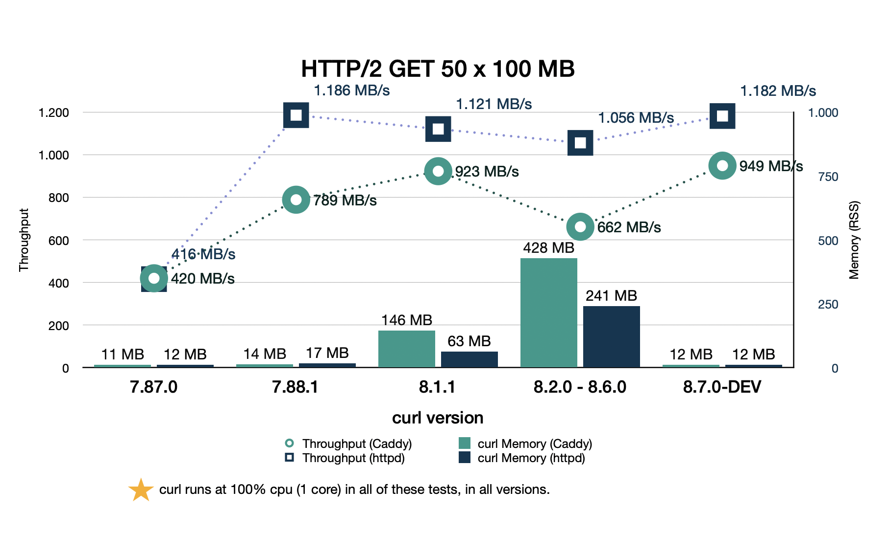
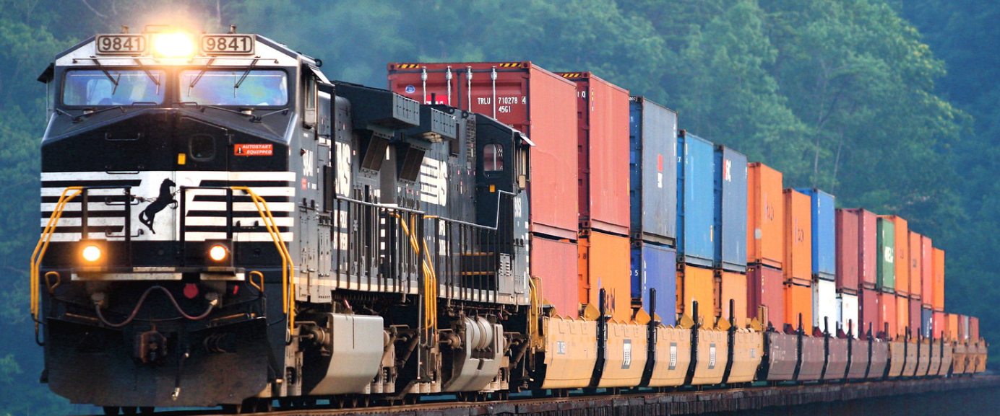

# curl HTTP/2 Performance Evolution

Over the last 15 months I worked in [curl](https://curl.se) on various HTTP related areas. HTTP/2 is a good example of what has changed and I'd like to give you an idea of what we have been and continue working on.

The following is technical. If you use curl occasionally to retrieve a single URL, you will not experience any of the things touched upon below. If you are more of a power user or into network stuff in general, I hope you'll find this interesting. (Even if not, should you use `git` or Rust's [cargo](https://github.com/rust-lang/cargo) you will benefit from curl's improvements here anyway.)

For network I/O, there are three interesting things to measure: throughput, memory and cpu. High numbers of megabytes per second are always nice, but what does one need to pay for that? Or you look at it the other way around: having such and such cpu power available, what can you get out of it in I/O? Or you have a certain speed limit on a mobile network and spending cpu/memory to process it means draining the battery. You'd want that minimized.

### The Test

The example I shine a light on here is: if we run curl, which is single threaded, against a server on the same machine with several gigabytes per second of theoretical transfers: 

* is the cpu single core the limiting factor?
* what throughput do we actually see?
* what amount of memory is used?

and last

* how does this vary in different curl versions?

### The Environment

I ran this on my development iMac (Intel i9-10910 CPU @ 3.60GHz, Memory 40 GB, 2667 MHz DDR4) which has 10 real cores, so 20 hyper threaded one. curl may peg 1/20th of the cpu, the rest is available for the server. As servers, Caddy v2.6.2 and Apache httpd 2.4.58 were used. The resources in the server were just static files on the SSD.

This out of the way...

### The Measurements

In the curlish green color you see the measurements for curl running against caddy. The dark blue ones are curl running against Apache httpd. The leftmost data points are from curl version 7.87.0, then version 7.88.1, 8.1.1, etc. curl versions 8.2.0 to 8.6.0 behave all the same, so I added just one data point for them. Last you see the 8.7.0-DEV version with my latest [PR 12828](https://github.com/curl/curl/pull/12828) applied.

If you compare left and right most, you see the same memory use of 12 MB but a more than doubling of the throughput achieved. And then there is some up and down in between, which I'll talk more about below.

curl is cpu-bound in all these runs, using ~100% of a cpu core. No tricks with additional threads or so. All versions run single-threaded.

What changed in the different versions? 

You can imagine a HTTP/2 connection being like a cargo train, carrying many containers. When it arrives at your door, you need to unload it one container at a time in the order they come. In the image below, that would be three red, followed by an orange, then two blue...you get it.

Now imagine the red containers belong to your 1st request, the blue ones are the 2nd, orange are for the 3rd, etc. curl does not know in which order these arrive. It can tell the server that has room for, like 10 red and 5 orange ones, but the server chooses in what order it sends them off.

The operating system tells curl that the train has arrived and curl starts unloading them. The time this takes is our throughput. Obviously, how that is being done makes quite a difference!

#### curl 7.87.0

This version has separate "unloaders" for each request. When the train arrival is signalled, it activates one unloader to go to the train and do its job. That might be the unloader for the blue containers. When it arrives at the train, it sees that the first container is red. "Can't do! Stop the train!" it says and returns. curl sends the orange unloader. Can't do its job either. Then it sends the red unloader and that unloads the first three containers. Hopefully after that it sends the orange one or it might block again.

Eventually, all containers are taken off the train this way. But quite a bit of back and forth had been involved. Everyone was very busy, but throughput suffered heavily.

#### curl 7.88.1

We modified the unloaders that they could - often, but not always - place a "wrong" container at the side of the track and continue. There was limited room for those. Too many "wrong" ones and it would block as before. But when the colors matched mostly, this was way faster than before (way faster for Apache which sends more containers of same color in a row than Caddy does).

#### curl 8.1.1

Placing containers at the side of the track was not a very secure place. In this version we implemented special, safe places for them, "Receive Buffers", able to hold many containers potentially. They would grow and shrink as needed. This introduced a little overhead when the order of the containers was fortunate, but gave improvements when it was not. (The Apache throughput went down a bit, Caddy improved.)

#### curl 8.2.0 - 8.6.0

Due to other changes our "unloaders" became a bit eager. Instead of unloading a few containers of the right color, they wanted to unload more. This then caused all wrong colored ones to be pushed into our receive buffers. This could mean that almost all containers ended up in the receive buffers before they could be processed.

With 50 requests, the receive buffers could grow to a whopping 500 MB of memory (curl tells the server to not send more than 10 MB for each request at a time). And in the Caddy case we almost reach that. Whoops!

#### curl 8.7.0-DEV, [PR 12828](https://github.com/curl/curl/pull/12828) 

We got rid of the receive buffers, completely. Instead, we created a new way of unloading. Our new HTTP/2 implementation can pass a container directly to the matching "unloader". All containers can be unloaded as they arrive and passed on for immediate processing. No buffering, no delay.

This sounds quite easy and a logical thing to do. But it required heavy reshuffling of curl's internal processing and response handling. Which is way it took some time to implement it.

### Conclusion

Even for an "old" protocol like HTTP/2 there are still things to improve. We hope the changes survive meeting the real world in curl version 8.7.0 and make parallel transfers better in your daily use.

We plan to incorporate the same improvements into out HTTP/3 backends. They operate quite the same, the train looks just a little different and floats in the air. Containers are way smaller, but there are thousands of them...

It's what we do.😌
